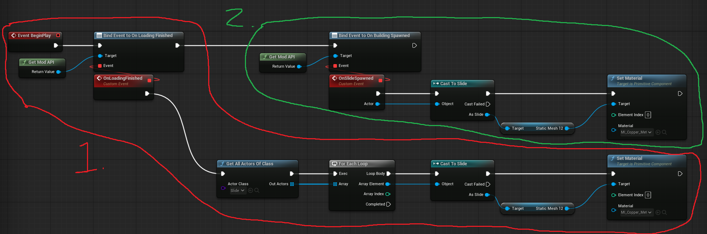
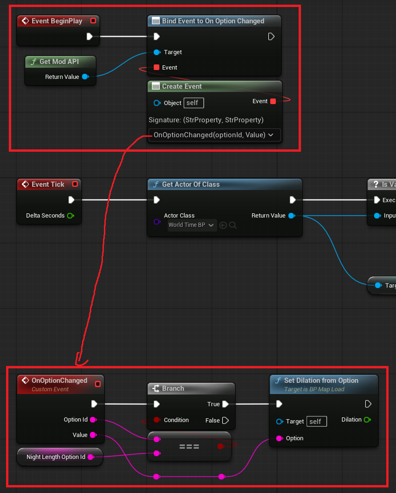

# Whiskerwood-Project
Template UE5.6 project for Whiskerwood, including reflected headers and example mods.

## How to open the project

If you haven't already, install Unreal Engine 5.6.

To use, [clone](https://docs.github.com/en/desktop/contributing-and-collaborating-using-github-desktop/adding-and-cloning-repositories/cloning-and-forking-repositories-from-github-desktop), fork or download the repository as .zip, and follow these steps, then double click on `Whiskerwood.uproject` to open the project!

**(Optional):** If you want to generate a `.sln` file to build the project from its source, right click the `Whiskerwood.uproject` file and click `Generate Visual Studio project files` (requires the correct build tools, there are plenty of docs online on how to build UE projects).

## Making mods

This project starts off with some example mod files inside of `Content/Mods`. 

As you can see, each mod has its own folder, then there are one or both of:

* `BP_Startup` - This blueprint is spawned by the game when the game loads into the main menu. This is the best place to register mod options or write values to a data table. See the "Some notes" below for more info.
* `BP_MapLoad` - This blueprint is spawned by the game while loading into a save. This is the place to do your game logic.

So, to make your own mod:

1. Inside of `Content/Mods`, make a new folder with your mod's name, ideally in UpperCamelCase. You can rename the mod folder later if you want.
2. Create a new blueprint with base `Actor` in the mod's folder you created and call it it one of the above two names, depending on what you want to do.

## ModAPI

The modding API provided by the game is pretty special, because the lead developer of Whiskerwood has added some awesome functions and delegates that help make modding easier. The game is also really moddable, because the game's architecture is using [data driven gameplay](https://dev.epicgames.com/documentation/en-us/unreal-engine/data-driven-gameplay-elements-in-unreal-engine?application_version=5.6) - much of the "hardcoded" values are actually in [Data Tables](https://dev.epicgames.com/documentation/en-us/unreal-engine/data-driven-gameplay-elements-in-unreal-engine?application_version=5.6#datatables)!

These are available properties that allows you to get references to some of the core game systems.

```cpp
UPROPERTY(EditAnywhere)
    class UBackbone *backbone;
UPROPERTY(EditAnywhere)
    class UOptionManager *optMan;
UPROPERTY(EditAnywhere)
    class UMasterSyncManager *masterSync;
UPROPERTY(EditAnywhere)
    FModApiState state;
```

These are functions that can be called. This extract includes developer comments.

```cpp
// Access the mod api. Static call with cheat look up so you do not need to store
// a reference.
UFUNCTION(BlueprintPure, meta = (WorldContext = "worldContext"), Category = "ModAPI")
    static UModAPI *GetModAPI(const class UObject *worldContext);

// Set the pool of possible whisker names from which new whiskers will be randomly named
UFUNCTION(BlueprintCallable, meta = (WorldContext = "worldContext"), Category = "ModAPI")
    void SetWhiskerNamePool(TArray<FString> names);

// Returns the list of all data tables accessible through the modapi's read and write calls
UFUNCTION(BlueprintCallable, meta = (WorldContext = "worldContext"), Category = "ModAPI")
    TArray<FName> ListDataTables(class UObject *worldContext);

// Outputs the entire data table to the mod log file as json
// Outputs the full table as JSON to %localappdata%/Whiskerwood/Logs/TABLENAME.json
UFUNCTION(BlueprintCallable, meta = (WorldContext = "worldContext"), Category = "ModAPI")
    void DumpDataTableToLogFolder(class UObject *worldContext, FName datatableName);

// Outputs all modapi accessible datatables to the %localappdata%/Whiskerwood/Logs/ folder as jsons
UFUNCTION(BlueprintCallable, meta = (WorldContext = "worldContext"), Category = "ModAPI")
    void DumpAllDataTablesToLogFolder(class UObject *worldContext);

// Read the value of a data table entry. See modapi's ListDataTables to get an updated listing of exposed data tables
UFUNCTION(BlueprintCallable, meta = (WorldContext = "worldContext"), Category = "ModAPI")
    FString ReadDataTableValue(class UObject *worldContext, FName datatableName, FName rowId, FName columnName);

// Write the value of a data table entry. See modapi's ListDataTables to get an updated listing of exposed data tables
UFUNCTION(BlueprintCallable, meta = (WorldContext = "worldContext"), Category = "ModAPI")
    bool WriteDataTableValue(class UObject *worldContext, FName datatableName, FName rowId, FName columnName, FString valueStringified);

// Add a new option to the Mod tab of the settings menu
// In the optionDisplayName make sure to prepend your mod's name so players know which option is yours
UFUNCTION(BlueprintCallable, meta = (WorldContext = "worldContext"), Category = "ModAPI")
    bool RegisterModOptions(class UObject *worldContext, FString optionId, FString optionDisplayName, TArray<FString> values, FString defaultValue, FString optionDescription = "");

// Read the current value of an option on the settings menu.
// This function can check non mod options as well.
// Avoid calling on tick(), if you need updated values register on the onOptionChanged delegate
// If players have not chosen a value from the settings menu, the fallbackValue will be returned to you
UFUNCTION(BlueprintCallable, meta = (WorldContext = "worldContext"), Category = "ModAPI")
    FString ReadModOptionValue(class UObject *worldContext, FString optionId, FString fallbackValue);

// Log a message to %localappdata%/Whiskerwood/Logs/modlog.txt
// The log file will be truncated to 1million chracters after writing.
UFUNCTION(BlueprintCallable, meta = (WorldContext = "worldContext"), Category = "ModAPI")
    void LogMessage(class UObject *worldContext, FString msg);

// Read text file in location %localappdata%/Whiskerwood/Mods/MODNAME/FILENAME
// Read a text file into string. Mod Name must be under 100 chars and alphanumeric. Same limits apply to filename.
// The filename must point to a file within the modname folder within the mods folder.
// Avoid calling often as the file read is sync and will cause a frame stutter.
UFUNCTION(BlueprintCallable, meta = (WorldContext = "worldContext"), Category = "ModAPI")
    FString ReadModTextFile(class UObject *worldContext, FString modName, FString filename);
```

These are delegates that you can bind to in your mod, then fire an event from that.

```cpp
UPROPERTY(BlueprintAssignable)
    FModAPI_OnEvent onLoadingFinished;
UPROPERTY(BlueprintAssignable)
    FModAPI_OnActorSpawned onConstructionSpawned;
UPROPERTY(BlueprintAssignable)
    FModAPI_OnActorSpawned onBuildingSpawned;
UPROPERTY(BlueprintAssignable)
    FModAPI_OnActorSpawned onWhiskerSpawned;
UPROPERTY(BlueprintAssignable)
    FModAPI_OnOptionChange onOptionChanged;
```

For example, in `Content/Mods/CopperSlides/BP_MapLoad`, it is binding on two delegates:

1. `onLoadingFinished` - This is because the mod updates the material of all slide actors in the world, which depends on those actors having been spawned in (or loaded) during the loading screen first. `BP_MapLoad` itself spawns during the loading screen, so without this delegate, many or all slide actors would not spawn in time to get a reference to in the mod. *You may be tempted to use a delay node instead, but this is a bad idea because big saves take a long time to load.*
2. `onBuildingSpawned` - This is because when the player builds a new slide, we need to apply the copper material to the new slide. This delegate fires when a building is spawned and returns the reference to that actor, which we check if is a slide, and if it is (if the cast to slide is successful), then apply the copper material.



`onOptionChanged` is required when your mod is changing a mod option value and you need to check if the user has changed a mod option during runtime, then do logic based on that. 

For example, in `Content/Mods/ShortNights/BP_MapLoad`, if the player changes the night speed multiplier option, the delegate will fire and then it updates the internally tracked time dilation variable:



It simply checks if the returned `OptionId` is the one used by the mod, and if it is, then the user has changed that option value.

## Some notes

If you want to run the same or similar logic in both `BP_Startup` and `BP_MapLoad`, it is recommended to create a third blueprint which the first two can spawn. 

### Mod Options

If changing a data table value, you must do it **as soon as possible in `BP_Startup`**, NOT in `BP_MapLoad`, otherwise the **changes may not take effect** - some things load values from the tables at runtime, some things only load values from them once at level initialisation before mods are loaded.

Please **register your mod options inside of `BP_Startup`**. They will still exist when the map loads even if you don't register in `BP_MapLoad`. You could register them in `BP_MapLoad` only, however the player then would not be able to configure the mod options until they enter the level.

When registering mod options, please **put your mod name at the start of Option Id and Option Display Name**. For option id, this is best practice as it massively reduces the possibility of conflicting with other mods. For display name, this will help show the user which mod the option is coming from.

It is recommended to **make variables for storing your Option Ids** because it reduces the chance of human error.

If you want to update your mod to **change the values of an option** (for example, seconds to minutes), you should **change the optionId to a new one**. This is because when an option Id is loaded in-game, the player's selection is loaded in from the previous option value, which would likely cause unintended behaviour. 

## Credits

Project headers are generated by [Suzie](https://github.com/trumank/Suzie) and [jmap_dumper](https://github.com/trumank/jmap). Thank you so much Archengius and trumank for working on these incredible tools!