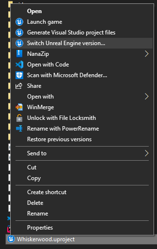
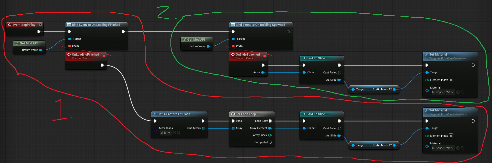
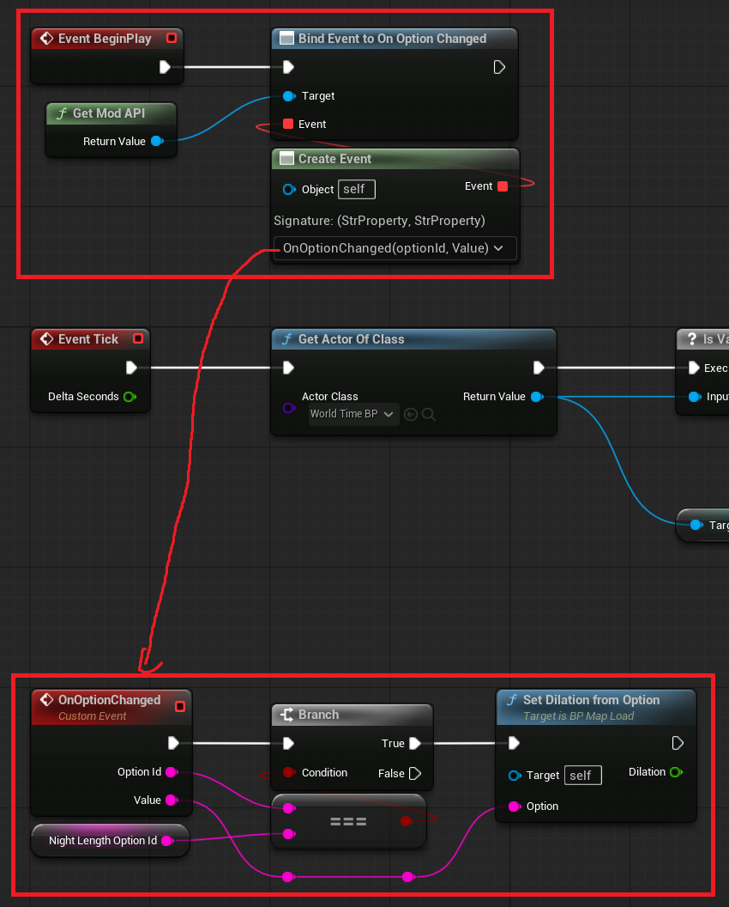
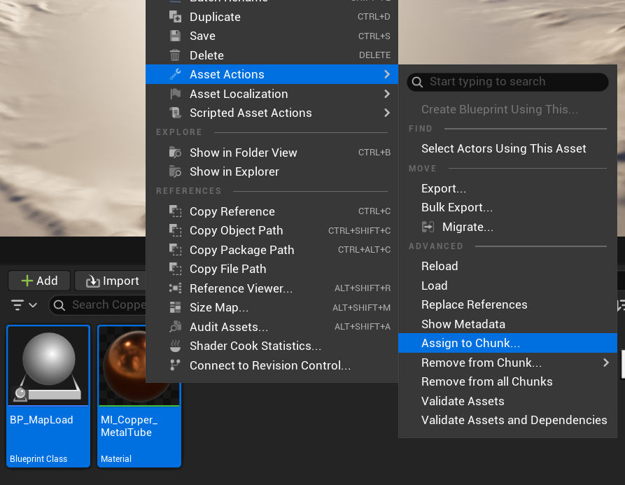
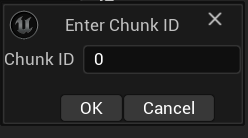
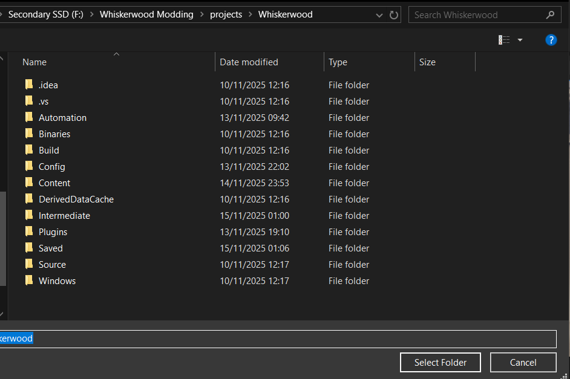
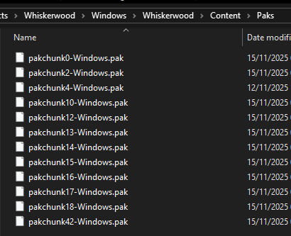
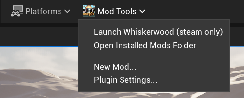
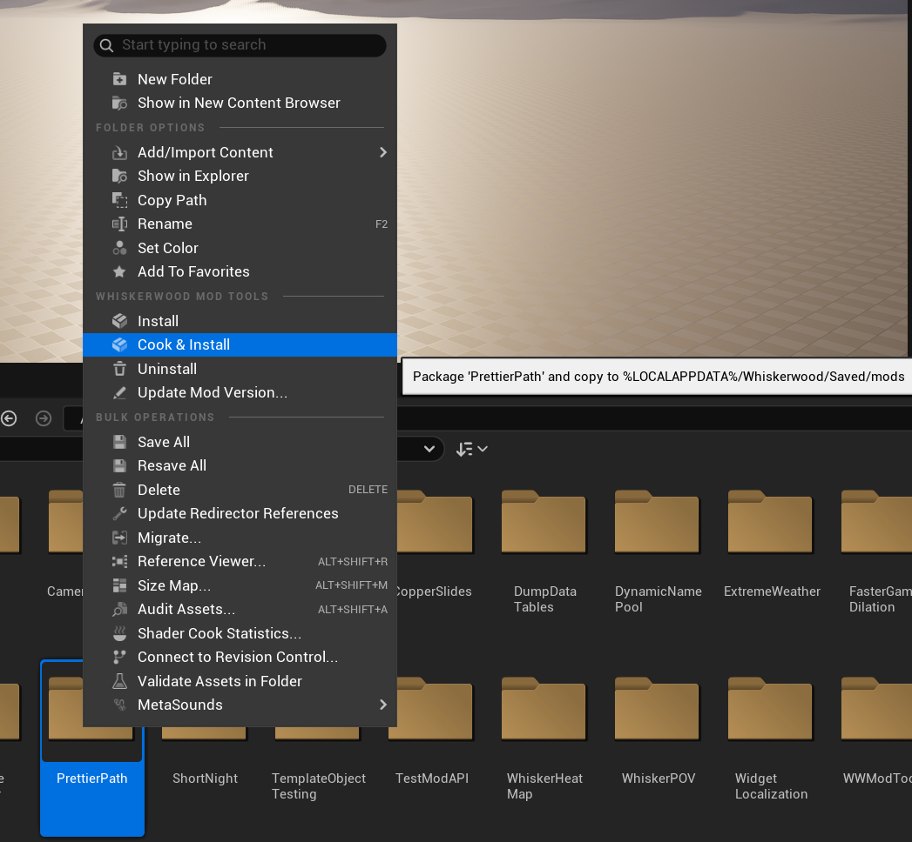

# Whiskerwood Project

The official modkit for creating Whiskerwood mods!

## FAQ

### What is the purpose of this project?

This project makes it as easy to make Whiskerwood content as it is for the developers themselves! Add in your own logic, modify other game content at runtime, add new buildings, decorations, UI elements, recipes, technologies, change game balance and such much more!

### Can I play the game in the project?

No. This project contains no source code from Whiskerwood - not in C++, nor in blueprint code. All code that exists in the project are "stubs" - dummy code that defines the signature of game code, only used for references when making content. These references then point to the actual game code when the mod is loaded.

### Does this project contain Whiskerwood source assets?

No. This project only contains assets from within the Whiskerwood's install directory. You also need to own the game and have it installed.

### Wait, but then how can I see the game's assets in the editor?

More on this later, but in a nutshell, the editor is directly loading and showing the contents in Whiskerwood's game install files, including its shaders!

### I am new to Unreal modding, where do I start?

Please get familiar with the basics of modding with this excellent set of guides:

https://github.com/Dmgvol/UE_Modding/

Also start with a basic mod idea, such as changing a data table value (those that can be found in `Whiskerwood > Content > Data` in FModel).

Get started with [basic mod tooling](./Docs/Tools.md) as outlined in the above UE Modding guides.

Some great docs about the inner workings of the game and how they work are being written up on the [Whiskerwood Wiki](https://wiki.hoodedhorse.com/Whiskerwood/Modding)

## Setup

<details>
<summary><span style="font-size: 1.5em">Prerequisites</span><hr></summary>

You need to own Whiskerwood and have the game installed.

The disk space that will be used - including custom engine and any intermediate folders created while using the project - is **40GB**. 

If you haven't done so already, [follow these instructions on linking your Epic Games and GitHub accounts](https://www.epicgames.com/help/en-US/c-Category_EpicAccount/c-ConnectedAccounts/how-do-i-link-my-unreal-engine-account-with-my-github-account-a000084938?sessionInvalidated=true). If you don't do this, the below custom engine link will return a 404 not found.

## Windows users

You need to install a [custom build of Unreal Engine 5.6](https://github.com/Buckminsterfullerene02/UnrealEngine/releases) (don't worry, you don't need to build or compile anything!). This build is approximately 10GB smaller than the vanilla build from Epic Games Store and is **necessary** to enable loading and working with the game content in the editor.

It is best to install the engine:
- Closer to the root of the drive (if file paths get too long, things break)
- On a file path containing no spaces (some issues occur from not quoting paths correctly)
- Onto an SSD or NVMe

You also need to install Visual Studio 2022 and select the MSVC `v14.38` toolchain to be able to open the project.
- [Helpful guide](https://dev.epicgames.com/documentation/unreal-engine/setting-up-visual-studio-development-environment-for-cplusplus-projects-in-unreal-engine?application_version=5.6)
- [Reddit post in case you get stuck](https://www.reddit.com/r/unrealengine/comments/1i0bopv/detected_compiler_newer_than_visual_studio_2022/)

## Linux users

While I haven't tested it, this project should also work on Linux - you can package mods for Win64 and Linux platforms from here, and the mods will work exactly the same way.

To keep the custom engine build size minimal, it is only built for Win64 platform. Therefore, on Linux, you will need to build the engine from source.

Build the engine version for the latest tag that this project is against - for example, if this project's last tag is `ww-v0.7.207.0`, build on the engine commit on the same tag `ww-v0.7.207.0`. 
https://github.com/Buckminsterfullerene02/UnrealEngine/tags

The instructions for building the engine and project is the same as any other Unreal Engine project on Linux - plenty of tutorials out there.

Note: I haven't tested any of the automation (Suzie or Whiskerwood Mod Tools) on Linux. Results may vary, or require fixups. Please contribute with fixes if required!

</details>

<details>
<summary><span style="font-size: 1.5em">Setting up and opening the project</span><hr></summary>

1. [Clone](https://docs.github.com/en/desktop/contributing-and-collaborating-using-github-desktop/adding-and-cloning-repositories/cloning-and-forking-repositories-from-github-desktop) or fork this repository. You may choose to download as `.zip`, but it will be much harder to get updates to the project if you do not clone it using `git` directly.

2. Open `GameInstallDirectory.txt` and paste in the location of your game install files (doesn't matter where you bought the game from) like the example path. This should be the folder containing the `Whiskerwood.exe` file.

**Note:** Content in the editor is read-only, meaning that even if it allows you to edit the asset, the package cannot be saved and the value will be lost the next time you open the editor. Later on, I will show you how to create uncooked copies of some assets which you can use in your mods.

3. Now right click on `Whiskerwood.uproject`, select **Switch Unreal Engine version**, then select to the folder containing the `Engine` folder from the custom engine.



For example mine is here (obviously pick the path where you installed the engine to):


4. Open `Whiskerwood.uproject`. It may spend some time compiling some plugins and shaders on the first time you open the project (5-10 mins depending on your hardware).

</details>

<details>
<summary><span style="font-size: 1.5em">Navigating the project</span><hr></summary>

Once the project is open and you can see all the content, there are some additional tips you need to know to use it properly (aside from common UE editor actions):
- When opening blueprints and widgets, you will just see a properties view. To see more info about the asset:
    - Right click on blueprints and click "Make Uncooked Bluepriny Copy", this then allows you to see the component tree, variables, functions and event stubs
    - Right click on widgets and click "Make Uncooked Widget Copy", this makes a copy of the cooked widget into an uncooked one with the full widget tree and animations
    - Right click on animation blueprints and click "Make Uncooked Animation Blueprint Copy", this does the same as blueprints and widgets
- If you want a mod blueprint to inherit from a game blueprint, you can right click on it and click "Make child blueprint"
- You can make new material instances from an existing game material by right clicking the material or material instance and clicking "Create Material Instance". You can then adjust the parameters and see how it will look in the editor, in real-time
- You can see how game assets reference each other by right clicking on an asset and clicking "Reference Viewer..."

</details>

## Mod API

The modding API provided by the game is pretty special, because the lead developer of Whiskerwood has added some awesome functions and delegates that help make modding easier. The game is also really moddable, because the game's architecture is using [data driven gameplay](https://dev.epicgames.com/documentation/en-us/unreal-engine/data-driven-gameplay-elements-in-unreal-engine?application_version=5.6) - much of the "hardcoded" values are actually in [Data Tables](https://dev.epicgames.com/documentation/en-us/unreal-engine/data-driven-gameplay-elements-in-unreal-engine?application_version=5.6#datatables)!

<details>
<summary><span style="font-size: 1.5em">Properties</span><hr></summary>

These are available properties that allows you to get references to some of the core game systems.

```cpp
UPROPERTY(EditAnywhere)
    class UBackbone *backbone;
UPROPERTY(EditAnywhere)
    class UOptionManager *optMan;
UPROPERTY(EditAnywhere)
    class UMasterSyncManager *masterSync;
UPROPERTY(EditAnywhere)
    class UModManager *modMan;
UPROPERTY(EditAnywhere)
    FModApiState state;
```

</details>

<details>
<summary><span style="font-size: 1.5em">Functions</span><hr></summary>

These are functions that can be called. This extract includes developer comments.

```cpp
// Access the mod api. Static call with cheat look up so you do not need to store
// a reference.
UFUNCTION(BlueprintPure, meta = (WorldContext = "worldContext"), Category = "ModAPI")
    static UModAPI *GetModAPI(const class UObject *worldContext);

// Set the pool of possible whisker names from which new whiskers will be randomly named
UFUNCTION(BlueprintCallable, meta = (WorldContext = "worldContext"), Category = "ModAPI")
    void SetWhiskerNamePool(TArray<FString> names);

// Add Data Table to the moddable table lookup
UFUNCTION(BlueprintCallable, meta = (WorldContext = "worldContext"), Category = "ModAPI")
    void AddDataTable(class UObject *worldContext, FName datatableName, class UDataTable *table);

UFUNCTION(BlueprintCallable, meta = (WorldContext = "worldContext"), Category = "ModAPI")
    bool HasDataTable(class UObject *worldContext, FName datatableName);

// Returns the list of all data tables accessible through the modapi's read and write calls
UFUNCTION(BlueprintCallable, meta = (WorldContext = "worldContext"), Category = "ModAPI")
    TArray<FName> ListDataTables(class UObject *worldContext);

UFUNCTION(BlueprintCallable, meta = (WorldContext = "worldContext"), Category = "ModAPI")
    TArray<FName> ListLanguageIds(class UObject* WorldContext);

// Outputs the entire data table to the mod log file as json
// Outputs the full table as JSON to %localappdata%/Whiskerwood/Logs/TABLENAME.json
UFUNCTION(BlueprintCallable, meta = (WorldContext = "worldContext"), Category = "ModAPI")
    void DumpDataTableToLogFolder(class UObject *worldContext, FName datatableName);

// Outputs all modapi accessible datatables to the %localappdata%/Whiskerwood/Logs/ folder as jsons
UFUNCTION(BlueprintCallable, meta = (WorldContext = "worldContext"), Category = "ModAPI")
    void DumpAllDataTablesToLogFolder(class UObject *worldContext);

// Read the value of a data table entry. See modapi's ListDataTables to get an updated listing of exposed data tables
UFUNCTION(BlueprintCallable, meta = (WorldContext = "worldContext"), Category = "ModAPI")
    FString ReadDataTableValue(class UObject *worldContext, FName datatableName, FName rowId, FName columnName);

// Write the value of a data table entry. See modapi's ListDataTables to get an updated listing of exposed data tables
UFUNCTION(BlueprintCallable, meta = (WorldContext = "worldContext"), Category = "ModAPI")
    bool WriteDataTableValue(class UObject *worldContext, FName datatableName, FName rowId, FName columnName, FString valueStringified);

// Add an empty row at the rowId. Does nothing if the row already exists
UFUNCTION(BlueprintCallable, meta = (WorldContext = "worldContext"), Category = "ModAPI")
    bool AddDataTableRow(class UObject *worldContext, FName datatableName, FName rowId);

// Add a new option to the Mod tab of the settings menu
// In the optionDisplayName make sure to prepend your mod's name so players know which option is yours
UFUNCTION(BlueprintCallable, meta = (WorldContext = "worldContext"), Category = "ModAPI")
    bool RegisterModOptions(class UObject *worldContext, FString optionId, FString optionDisplayName, TArray<FString> values, FString defaultValue, FString optionDescription = "");

// Read the current value of an option on the settings menu.
// This function can check non mod options as well.
// Avoid calling on tick(), if you need updated values register on the onOptionChanged delegate
// If players have not chosen a value from the settings menu, the fallbackValue will be returned to you
UFUNCTION(BlueprintCallable, meta = (WorldContext = "worldContext"), Category = "ModAPI")
    FString ReadModOptionValue(class UObject *worldContext, FString optionId, FString fallbackValue);

// Log a message to %localappdata%/Whiskerwood/Logs/modlog.txt
// The log file will be truncated to 1million chracters after writing.
UFUNCTION(BlueprintCallable, meta = (WorldContext = "worldContext"), Category = "ModAPI")
    void LogMessage(class UObject *worldContext, FString msg, bool doPrependDate);

// Read text file in location %localappdata%/Whiskerwood/Mods/MODNAME/FILENAME
// Read a text file into string. Mod Name must be under 100 chars and alphanumeric. Same limits apply to filename.
// The filename must point to a file within the modname folder within the mods folder.
// Avoid calling often as the file read is sync and will cause a frame stutter.
UFUNCTION(BlueprintCallable, meta = (WorldContext = "worldContext"), Category = "ModAPI")
    FString ReadModTextFile(class UObject *worldContext, FString modName, FString filename);

// Read a csv text file from %localappdata%/Whiskerwood/Mods/MODNAME/lang.csv
// The CSV should have the first row as a header. The first column should be the string id, the second column the translated text
UFUNCTION(BlueprintCallable, meta = (WorldContext = "worldContext"), Category = "ModAPI")
    bool AddNewTranslation(class UObject *worldContext, FString modId, FString translationName);

UFUNCTION(BlueprintCallable, meta = (WorldContext = "worldContext"), Category = "ModAPI")
    bool AddNewStrings(class UObject* WorldContext, FName langId, TMap<FName, FString> idStringPairs);
    
UFUNCTION(BlueprintCallable, meta = (WorldContext = "worldContext"), Category = "ModAPI")
    void DumpEnglishToLogFolder(class UObject *worldContext);
```

</details>

<details>
<summary><span style="font-size: 1.5em">Delegates</span><hr></summary>

These are delegates that you can bind to in your mod, then fire an event from that.

```cpp
DECLARE_DYNAMIC_MULTICAST_DELEGATE(FModAPI_OnEvent);
DECLARE_DYNAMIC_MULTICAST_DELEGATE_OneParam(FModAPI_OnActorSpawned, AActor *, actor);
DECLARE_DYNAMIC_MULTICAST_DELEGATE_TwoParams(FModAPI_OnOptionChange, FString, optionId, FString, value);
DECLARE_DYNAMIC_MULTICAST_DELEGATE_OneParam(FModAPI_OnDayStart, int32, day);

UPROPERTY(BlueprintAssignable)
    FModAPI_OnEvent onLoadingFinished;
UPROPERTY(BlueprintAssignable)
    FModAPI_OnActorSpawned onConstructionSpawned;
UPROPERTY(BlueprintAssignable)
    FModAPI_OnActorSpawned onBuildingSpawned;
UPROPERTY(BlueprintAssignable)
    FModAPI_OnActorSpawned onWhiskerSpawned;
UPROPERTY(BlueprintAssignable)
    FModAPI_OnOptionChange onOptionChanged;
UPROPERTY(BlueprintAssignable)
    FModAPI_OnDayStart onDayStart;
```

For example, in `Content/Mods/CopperSlides/BP_MapLoad`, it is binding on two delegates:

1. `onLoadingFinished` - This is because the mod updates the material of all slide actors in the world, which depends on those actors having been spawned in (or loaded) during the loading screen first. `BP_MapLoad` itself spawns during the loading screen, so without this delegate, many or all slide actors would not spawn in time to get a reference to in the mod. *You may be tempted to use a delay node instead, but this is a bad idea because big saves take a long time to load.*
2. `onBuildingSpawned` - This is because when the player builds a new slide, we need to apply the copper material to the new slide. This delegate fires when a building is spawned and returns the reference to that actor, which we check if is a slide, and if it is (if the cast to slide is successful), then apply the copper material.



`onOptionChanged` is required when your mod is changing a mod option value and you need to check if the user has changed a mod option during runtime, then do logic based on that. 

For example, in `Content/Mods/ShortNights/BP_MapLoad`, if the player changes the night speed multiplier option, the delegate will fire and then it updates the internally tracked time dilation variable:



It simply checks if the returned `OptionId` is the one used by the mod, and if it is, then the user has changed that option value.

</details>

## Guides

<details>
<summary><span style="font-size: 1.5em">Making your first blueprint mod</span><hr></summary>

This project starts off with some example mod files inside of `Content/Mods`. 

As you can see, each mod has its own folder, then there are one or more of:

* `BP_Startup` - This blueprint is spawned by the game **the first time** the game loads into the main menu. This is the best place to register mod options or write values to a data table. See the "Some notes" below for more info.
* `BP_MapLoad` - This blueprint is spawned by the game while loading into a save. This is the place to do your game logic.
* `BP_MainMenuLoad` - Triggered after `BP_Startup` but unlike startup, it will be triggered every time the main menu loads, not just the first time. This is good for doing modding on the main menu widgets/logic themselves.

So, to make your own mod:

1. Inside of `Content/Mods`, make a new folder with your mod's name, ideally in UpperCamelCase. E.g. `MyMod`.
2. Create a new blueprint with the base as `Actor` in the mod's folder you created and call it one of the above three names, depending on what you want to do. E.g. `BP_Startup` which would have the path `Content/Mods/MyMod/BP_Startup`.

</details>

<details>
<summary><span style="font-size: 1.5em">Packaging the mod (manual)</span><hr></summary>

## Packaging your mod

In this project, we use pak chunks to package your mod files into `.pak` mods.

In your mod folder, right click and select **Miscellaneous > Data Asset**:


Now search for and select `Primary Asset Label`.



To follow standard UE naming conventions, call it `PAL_yourmodname` e.g. `PAL_DemoMod`.



Open the asset, set `Cook Rule` to `Always Cook`, and check `Label Assets in My Directory`, like so.


Enter a number between `1` and `300` in this chunk Id field and press Ok. **Do not enter 0 for the Id!**

> [!IMPORTANT]
> Each mod **must** use a seperate pak chunk number to get packaged seperately from each other! Take note of each pak chunk Id you are assigning to files in each mod.



This PAL is a good pal, because it will automatically assign all files in your mod folder with the chunk Id you set for it. It does not get packaged into the game (unless you explicitly tell it to), as it's just a tool for the editor.

Now do `Ctrl` + `S` to save.

Simply click on to `Platforms` -> `Windows` -> `Package Project`:



Now select the output folder location. It doesn't matter much where you put it, so I always just put it into the template project folder. It will create a `Windows` folder. You don't need to delete this folder between packages.


The first time you package it might take a while, as it will likely need to compile some shaders.

Once it is done, you will hear a noise and it will say Packaging complete.

Now navigate to the `Windows/Whiskerwood/Content/Paks` folder, you should see al pakchunk files here. There will always be a `pakchunk0` which contains all other packaged editor assets, and it is quite large, so this is why you mustn't set your chunkId to 0.


</details>

<details>
<summary><span style="font-size: 1.5em">Installing the packaged mod (manual)</span><hr></summary>

First copy the pakchunk id file, for the number you entered for your mod files. E.g. you set your id to 42, so copy `pakchunk42-Windows.pak`. 

Navigate to `%localappdata%\Whiskerwood\Saved\mods\` and create a folder for your mod. It should have the same name as the mod folder in the unreal engine project.

Now paste your `.pak` file into the mod folder.

Rename the `.pak` file to the same name as the mod folder in the project, keeping the `.pak` extension.

> [!IMPORTANT]
> The `.pak` file must be the same name as the mod folder in the unreal engine project! If you change the mod folder name in the project later, make sure the update the `.pak` file name to match it! E.g. if the mod folder in the project is `MyMod`, the `.pak` must be called `MyMod.pak`.

Now your mod is installed! You should also make a `<yourmodname>.uplugin` file and fill in the details, but this is not strictly necessary right now.

Here is an example one:
```json
{
    "Name" : "Prettier Path",
    "Description" : "Makes the stone path look prettier!",
    "Version" : "1.0",
    "CreatedBy" : "Buckminsterfullerene"
}
```

So just to check, you should have the following mod file structure:

```
%localappdata\Whiskerwood\Saved\mods\
|- MyMod
   |- MyMod.pak
   |- MyMod.uplugin
```

</details>

<details>
<summary><span style="font-size: 1.5em">Automation: Whiskerwood Mod Tools</span><hr></summary>

The above steps are too manual to repeat over and over, but I explained them first so that you understand what the automation is actually doing (in case something breaks and you need to look at why).

So this is where the Whiskerwood Mod Tools plugin comes in to help reduce the load.

In the editor, in the play in editor toolbar, you will notice the button for Mod Tools:



To make a new mod, simply click `New mod...` and type in mod name, and it will create the mod folder, the PAL, and assign an unused chunkid to it.

Then to cook the project and install a mod, right click on the mod folder and select `Cook & Install`. 



If you have multiple mods that you want to install after a single cook, you may also click on `Install` and that will install that mod's packaged files without having to recook again. And to uninstall the mod, just `Uninstall` button.

Finally, you can quickly launch Whiskerwood by clicking the Mod Tools button and clicking `Launch Whiskerwood`. **Note:** auto-launch currently only works when the game is installed through steam.

</details>

<details>
<summary><span style="font-size: 1.5em">Adding localization support</span><hr></summary>

[Please follow the guide](Docs/Localization.md)

</details>

<details>
<summary><span style="font-size: 1.5em">Extra notes (please read!)</span><hr></summary>

If you want to run the same or similar logic in both `BP_Startup` and `BP_MapLoad`, it is recommended to create a third blueprint which the first two can spawn. 

## Mod Options

If changing a data table value, you must do it **as soon as possible in `BP_Startup`**, NOT in `BP_MapLoad`, otherwise the **changes may not take effect** - some things load values from the tables at runtime, some things only load values from them once at level initialisation before mods are loaded.

Please **register your mod options inside of `BP_Startup`**. They will still exist when the map loads even if you don't register in `BP_MapLoad`. You could register them in `BP_MapLoad` only, however the player then would not be able to configure the mod options until they enter the level.

When registering mod options, please **put your mod name at the start of Option Id and Option Display Name**. For option id, this is best practice as it massively reduces the possibility of conflicting with other mods. For display name, this will help show the user which mod the option is coming from.

It is recommended to **make variables for storing your Option Ids** because it reduces the chance of human error.

If you want to update your mod to **change the values of an option** (for example, seconds to minutes), you should **change the optionId to a new one**. This is because when an option Id is loaded in-game, the player's selection is loaded in from the previous option value, which would likely cause unintended behaviour. 

</details>

<details>
<summary><span style="font-size: 1.5em">Updating the project yourself</span><hr></summary>

## Updating

If the game updates and the project breaks for whatever reason, you need to update at the minimum:
- `Content/DynamicClasses/Whiskerwood-x.x.xxx.x.jmap`
- `AssetRegistry.bin`

You can run the [`update.bat`](Automation\update.bat) script (change install dir variable at the top if your game install is not the default steam one) which will automatically re-generate the jmap file, the usmap for FModel, the asset registry file and diff files to get parity with the game. Make sure you check what it does first before running it!

## How to check what has changed between updates

In the `Automation` folder, there is a `diff.hpp` file which is also generated using [jmap_dumper](https://github.com/trumank/jmap) and it is just one file for everything. So when this file updates, you can run a `git diff` on it or go to the github website and click on the file history to see a diff of the file in the website (if it isn't too long to be loaded).

</details>

<details>
<summary><span style="font-size: 1.5em">How the "cooked editor" project works</span><hr></summary>

I have written a guide containing all of the technical information required for this to be replicated for other games - and that it has! Due to this work, the Palworld modkit is reaching this level of completeness, which serves an even greater audience of modders for years to come!

https://buckminsterfullerene02.github.io/dev-guide/ModSupport/ModKits/DeveloperModkits/CookedEngine.html

</details>

## Credits

Project headers are generated by [Suzie](https://github.com/trumank/Suzie) and [jmap_dumper](https://github.com/trumank/jmap). Thank you so much Archengius and trumank for working on these incredible tools!

### Please return the favour!

Speaking of credits... if you release a mod using this project, I only ask that you add a credit to the project in your mod description - something like

> Created using the Whiskerwood modkit https://github.com/Whiskerwood-Modding/Whiskerwood-Project

## Thanks and happy modding!

\- Buckminsterfullerene
